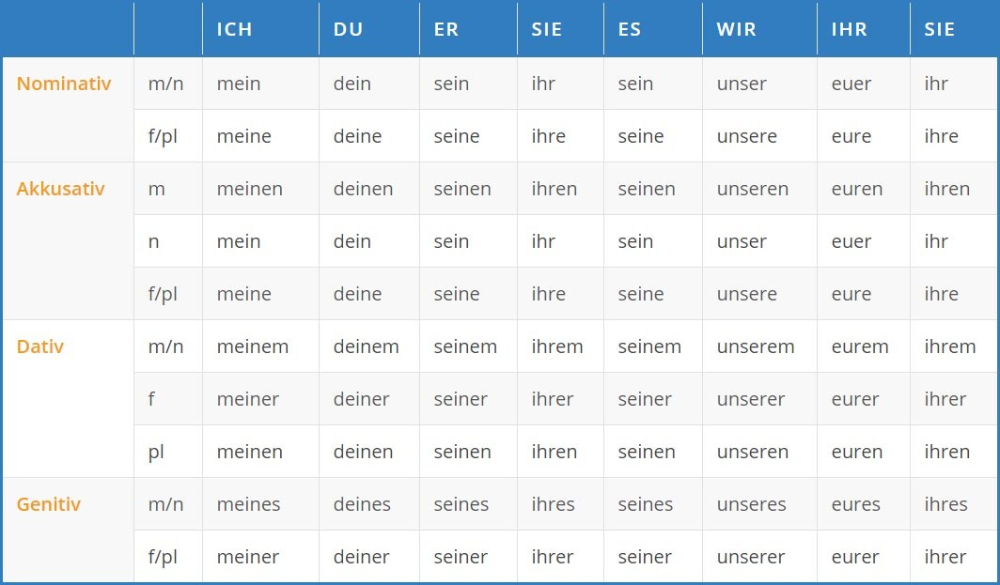

# Lesson 16

Date: Wednesday, 10.11.2021
Topic: Revision

Special Letters: ä ö ü ß

## Vocabulary

- beispiel: example

## Sentences

- Ich schlafe in meine Schlafzimmer
- Ich Koche für meinen Freund.
- Ich liege meinen Kugelschrieber auf meinem Tisch.

## Important Topics

### Possessive Pronouns

### Using personal pronouns in Akkusative and Dative

- Some prepositions are purely dative, for them we use dative possessive pronouns. For purely Akkusative prepositions, we use aAkkusative possessive pronouns.
- When 2 objects in a sentence, with direct object, Akkusative personal pronoun is used and with indirect, Dative is used. E.g "Ich liege meinen Kugelschreiber auf meinem Tisch".

For example: Ich kaufe sein Handy vor seinem Freund.
