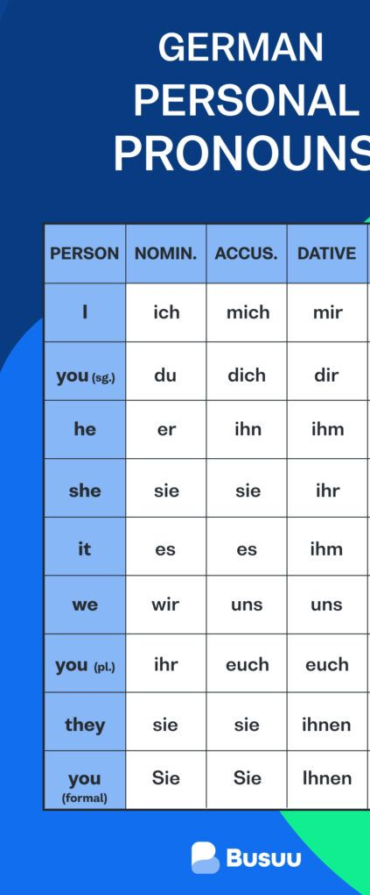

# Lesson 18

Date: Wednesday, 17.11.2021
Topic: Alphabets

Special Letters: ä ö ü ß

## Vocabulary

- einfach: easy
- schwierig: difficult

## Sentences

- Ich liebe meine Mutter.
- Mein Vater hat einen Vater. Er ist mein GroßVater. Ich kenne ihn.

## Important Topics

### Possessive Pronouns

- Kennst du di Frau? -> Jam Ich kenne sie.
- Sieht er das Auto> -> Jam er sieht es.
- Habt ihr die Bücher? -> Ja, wir haben sie.
- Hast du den Schlüssel? -> Ja, ich habe ihn.

- Ja, er sieht das Kind -> Siehst er das Kind.
- Wir sehen fünf Stuhle -> Wie viele Stuhle sehn sie (WH Frage have special format).
- Er hat zwei Brüder. -> Wie viele Bruther hat er? (Zahlen Frage has special form).

## Tips

- Everything (living as well as non living) has a gender in German.
- isst, sind, bist, and bin are used as helping verb when there are two verbs in sentence.
